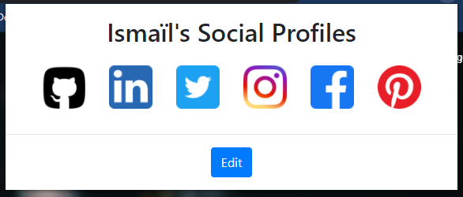
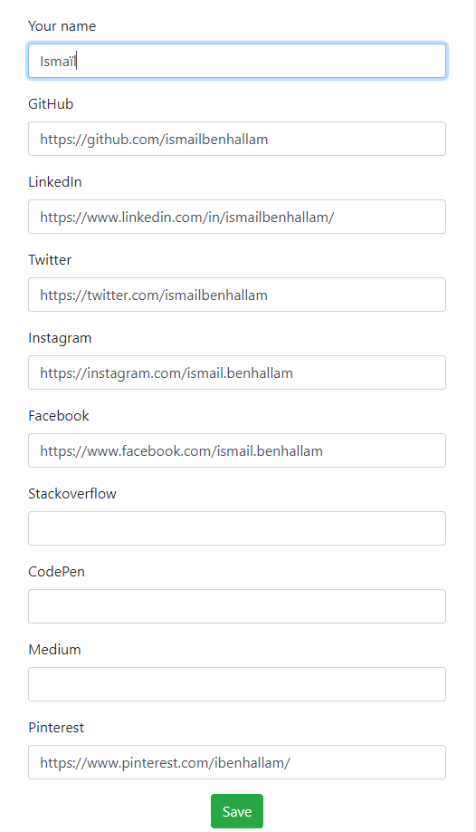

#  My-Profiles-Chrome-Extension

This extension will hold your profiles' links (GitHub, LinkedIn...) for quick access.

Save the URLs of your profiles in different websites (social networks), to be able to access them in a handy way,  with a single click !  
Save them once, use them everyday ;)

You can download this extention from [Chrome Web Store](https://chrome.google.com/webstore/detail/my-profiles/cglodpgmmhfodebodfpmhgjpjkglpecf)

   
  

